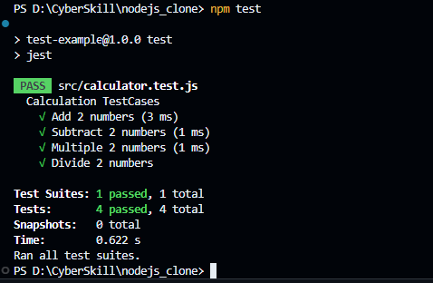

 
 # Lab Assignment Final (Lab 02)

 ---

 ## Objective Target :
### Code Verification:
- Linting to ensure the source code follows standards.
- Running unit tests with Jest to validate application logic.
### Build Docker Image:
- Build a Docker image from the source code and push it to Docker Hub.
### Deploy Docker Container:
- Pull the Docker image from Docker Hub and run the container in a local or cloud environment.

---

## CI/CD Configuration with GitHub Actions
### Workflow File: [Click here](/.github/workflows/node.js.yml)
#### Trigger: The pipeline runs on:
- Push or Pull Request to the main branch.
#### Jobs:
- Lint and Test:
    - Runs on Ubuntu with Node.js versions 18.x and 20.x.
    - Tasks include:
        - Installing dependencies ```npm ci```.
        - Running linting ```npm run lint```.
        - Running unit tests ```npm test```.



- Build Docker Image:
    - Builds the application into a Docker image and pushes it to Docker Hub.
    - Uses GitHub Secrets for Docker Hub authentication.


- Deploy Container:
    - Pulls the Docker image from Docker Hub.
    - Runs the container on port ```10000```.

---

## Source Code Breakdown
### a. Main Code: [index.js](/index.js)
- A Node.js application using Express.js to provide APIs:
    - Endpoint /: Returns a description of the lab.
    - Endpoint /getInfo: Returns personal information.
    - The application listens on port 10000.
### b. Calculation Module: [calculator.js](src/calculator.js)
- Supports basic mathematical operations: ```Add``` (Addition), ```subtract``` (Subtraction), ```multiple``` (Multiplication), ```divide``` (Division).
### c. Unit Tests: [calculator.test.js](src/calculator.test.js)
- Uses Jest to test the functions in calculator.js. Ensures: Functions ```Add```, ```subtract```, ```multiple```, and ```divide``` return correct results.
### d. Dockerfile : [Dockerfile](/Dockerfile)
- Defines the Docker image for the application:
    - Base image: ```node:20.17.0```.
    - Installs dependencies and copies source code into the container.
    - Exposes port 10000 and starts the app using ```npm start```.
### e. ESLint Configuration: [eslint.config.mjs](/eslint.config.mjs)
- Configures ESLint to enforce coding standards.
- Includes support for global variables from Node.js and Jest.
### f. Package : [package.json](/package.json)
- Manages dependencies and scripts:
    - ```start```: Runs the application (```node index.js```).
    - ```test```: Runs unit tests with Jest (```npm test```).
    - ```lint```: Lints the codebase with ESLint (```npx eslint .```).
- Dependencies:
    - ```express```: A framework for building REST APIs.
- DevDependencies:
    - ```jest```: A framework for writing and running tests.
    - ```eslint```: A tool to enforce coding standards.

---

## Steps to Set Up and Run the Pipeline
### Step 1: Clone the Project

```
git clone https://github.com/arifsetiawan/node-test-sample.git
cd node-test-sample
npm install
```

### Step 2: Configure Docker Hub
1. Create a Docker Hub account.
2. Save these credentials (just applied for my Docker Hub account):
- ```DOCKER_PASSWORD```: Docker / Docker Hub password.
- ```DOCKER_USERNAME```: Docker / Docker Hub username.
3. Add the above information to GitHub Secrets.
### Step 3: Push Code to Trigger the Pipeline
- Push code to the ```main``` branch or create a Pull Request. GitHub Actions will automatically run the following steps:
    1. Lint and test the code.
    2. Build and push the Docker image to Docker Hub.
    3. Deploy the Docker container.
### Step 4: Verify Results
- Check the pipeline status in the Actions tab on GitHub.
- If successful, access the API via:

```
curl http://localhost:10000/
curl http://localhost:10000/getInfo
```

## Expected Outcome
- The code will be verified with linting and unit tests.
- A Docker image will be successfully pushed to Docker Hub.
- The application will be deployed and accessible on port ```10000```.

## This lab is a complete demonstration of building and deploying a Node.js application with automated CI/CD